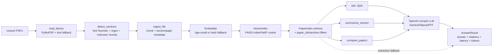

# Architecture

## Pipeline



The dashed edge shows the no-LLM path: if no provider is configured or the LLM call raises, `_generate_or_fallback` returns `extractive_answer()` which formats the top-2 chunks as a bulleted citation list. Tests run on this path so no network/creds are required.

## Module map

| File | LOC | Role |
|---|---|---|
| `paper_companion.py` | ~640 | Data layer: `Paper`, `Section`, `Chunk`, `Citation`, `RetrievalConfig`, `PaperIndex`, `ingest_corpus`, `build_index_from_corpus`, `extractive_answer`, CLI |
| `retrieval_primitives.py` | ~140 | Vendored: `BASELINE_EMBED_MODEL`, `split_text_recursive`, `Embedder` (sentence-transformers + hash fallback), `VectorIndex` (FAISS cosine/L2) |
| `modes.py` | ~265 | Mode router: `ask`, `summarize_section`, `compare_papers`, `AnswerResult`, `_CITATION_RULES`, `_generate_or_fallback` |
| `llm_provider.py` | ~80 | `OpenAIChatProvider` (`openai` SDK with `base_url` override); env-driven `build_provider` |
| `app.py` | ~190 | Gradio Blocks: Corpus / Chat / Summary / Compare tabs; one shared `AppState` w/ pre-built index |
| `scripts/author-eval-set-with-retrieval-validated-ground-truth.py` | ~220 | Eval-set author w/ retrieval-validated `(section, page)` GT |
| `scripts/run-eval-harness-and-compute-metrics.py` | ~225 | Dispatcher → mode router → metrics (coverage / hit-rate / refusal / latency / tokens) |
| `tests/test_paper_companion.py` | (codex) | 5 tests: ingest, section detect, retrieval, README-skip |
| `tests/test_modes.py` | ~85 | 6 tests: ask grounded/refusing, summary section-scoping/empty, compare same-paper/missing |

## Data contracts

### `Chunk`
```python
@dataclass(frozen=True)
class Chunk:
    chunk_id: str        # "{paper_id}:c{idx:05d}"
    paper_id: str        # "{arxiv-stem}-{8-char-hash}"
    section: str         # normalized heading (e.g. "initialization")
    page_start: int
    page_end: int
    text: str
    char_offset_start: int
    char_offset_end: int
```

### `PaperIndex.retrieve` record
```python
{
    "rank": 1,
    "score": 0.6743,
    "chunk": {asdict(Chunk)},
    "citation": {asdict(Citation)},   # includes quote_snippet (≤20 words)
}
```

### `AnswerResult`
```python
mode, query, answer, citations, retrieved,
grounded, refused, refusal_reason,
retrieval_latency_ms, generation_latency_ms,
token_usage_est, metadata
```

## Refusal logic (two-layer)

```
retrieve(query)
    ↓
no results OR top-1 score < min_score (0.30)?
    ↓ yes
refuse(reason="weak_retrieval" or "no_results")
    ↓ no
build context + system prompt + user prompt
    ↓
provider.generate(...) — system prompt rule 4 instructs LLM to
ask a clarifying question for vague queries instead of answering
    ↓ on exception
extractive_answer(query, records)  # fallback
```

## Citation tag format

```
[paper_id §section p.N #chunk_id]
```

Example:
```
[2403-04807-math-neural-networks-f32d05a721 §initialization p.27 #2403-04807-math-neural-networks-f32d05a721:c00567]
```

The harness counts a citation as matched when the chunk_id substring appears anywhere in the answer text. The LLM is shown identical tags in its context, so it can copy them verbatim.

## Provider abstraction

`llm_provider.OpenAIChatProvider` is a thin wrapper around the `openai` SDK. By configuring `OPENAI_BASE_URL` it talks to any OpenAI-compat endpoint:

| Provider | base_url | model |
|---|---|---|
| Google Gemini | `https://generativelanguage.googleapis.com/v1beta/openai/` | `gemini-2.5-flash-lite` |
| Local Ollama | `http://localhost:11434/v1` | `qwen2.5:3b-instruct` |
| FPT Cloud | `https://mkp-api.fptcloud.com/v1` | `Qwen3-32B` |

Switch by uncommenting the relevant block in `.env`.

## Test isolation

Tests run on the extractive fallback (`provider=None`) so they don't depend on network or LLM credentials. The LLM path is exercised by the eval harness, which surfaces real-model behavior in `results/eval_runs-vN-*.jsonl` snapshots.
